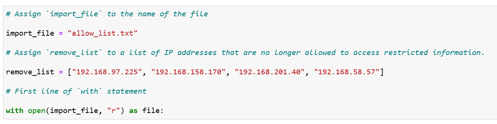
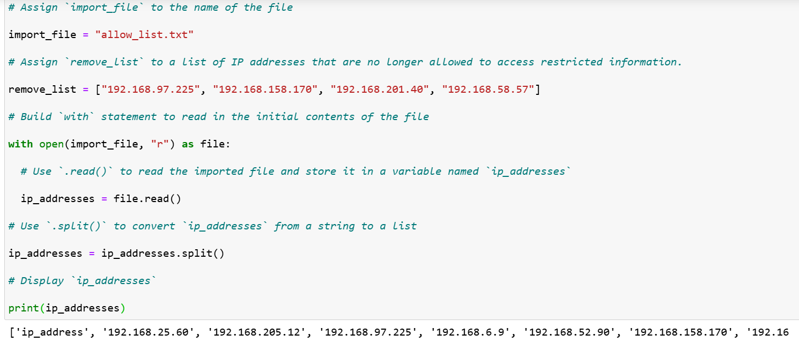
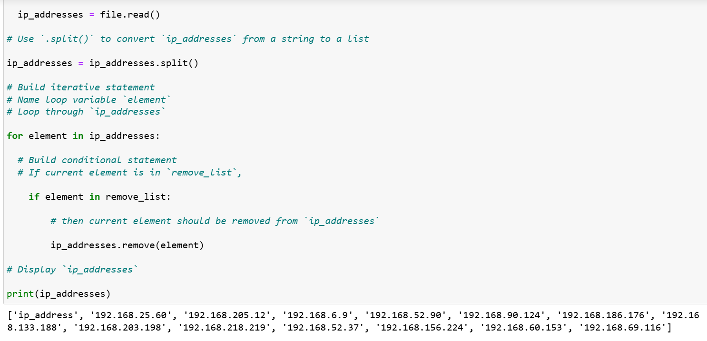

# 🐍 Project: Automating Access Control via Python

**Language:** Python 3  
**Focus:** Security Automation & Identity Access Management (IAM)

## 📝 Executive Summary
At a healthcare organization, maintaining strict access to patient records is critical for HIPAA compliance. In this project, I developed a Python algorithm to automate the management of an IP address "allow list." The script parses a restricted access file, compares it against a removal list of unauthorized users, and updates the system's permissions automatically. This project demonstrates how to reduce human error and ensure that only authorized personnel retain access to sensitive patient data through code.

---

## 🏗️ The Automation Process
Effective security automation requires a reliable and repeatable logic. I designed the algorithm to follow a standard lifecycle for file updates:
1. **Import:** Accessing the restricted file using safe handling practices.
2. **Parse:** Converting raw text data into a format (list) that Python can manipulate.
3. **Analyze & Filter:** Iterating through the data to identify and remove unauthorized entries.
4. **Update:** Finalizing the changes by overwriting the source file with the hardened dataset.

---

## 🔍 The Algorithm Logic Deconstructed

### 1. Safe File Handling
I utilized the `with open(import_file, "r") as file:` statement. This is a critical security best practice because it ensures the file is automatically closed after the script finishes, preventing memory leaks or accidental data corruption.



### 2. String to List Conversion
The data in `allow_list.txt` is read as a single string. To facilitate the removal of specific IPs, I used the `.split()` method. This converted the string into a list of individual IP addresses, making them accessible for iteration.



### 3. Iterative Removal Loop
I implemented a `for` loop to check every IP in a `remove_list` against the `allow_list`. By using a conditional `if` statement, the script only attempts to call `.remove()` if the IP is present, preventing the script from crashing on errors.



### 4. Finalizing the Update
To save the changes, I used the `"\n".join()` method to convert the list back into a newline-separated string. I then used `open(import_file, "w")` to overwrite the old file with the updated, secure version.


---

## 💻 Code Snippet
```python
# Define the file path and the list of IPs to be removed
import_file = "allow_list.txt"
remove_list = ["192.168.97.225", "192.168.158.170", "192.168.201.40"]

# Open and read the initial allow list
with open(import_file, "r") as file:
    ip_addresses = file.read()

# Convert the string into a list for processing
ip_addresses = ip_addresses.split()

# Algorithm to remove unauthorized IPs
for element in remove_list:
    if element in ip_addresses:
        ip_addresses.remove(element)

# Convert the list back to a string and overwrite the file
ip_addresses = "\n".join(ip_addresses)
with open(import_file, "w") as file:
    file.write(ip_addresses)
 ```
---

## 🛡️ Strategic Value
Automating access control lists (ACLs) provides several security benefits:

* **Consistency:** The script applies the same logic every time, eliminating the "missed line" error common in manual audits.
* **Speed:** Large lists (thousands of IPs) can be updated in milliseconds.
* **Compliance:** Provides a repeatable process that can be logged for HIPAA or GDPR audits.

---

## 💡 Key Skills Demonstrated
* **Security Scripting:** Developed functional Python code to solve a real-world IAM problem.
* **Data Parsing:** Proficiency in manipulating string and list data structures.
* **Safe File I/O:** Expertise in using context managers (`with`) for secure file operations.
* **Defensive Programming:** Using membership tests (`if element in ip_addresses`) to ensure script stability.

---

## 📂 Project Assets
For full transparency, the technical report and the walkthrough of the algorithm can be viewed below:

* 📄 [Python Algorithm for File Updates (Google Doc)](https://docs.google.com/document/d/1p-7hWhkUHtbGnOU7lVgS2GNdpYh5lphW27g8XTrxumk/edit?usp=sharing)
